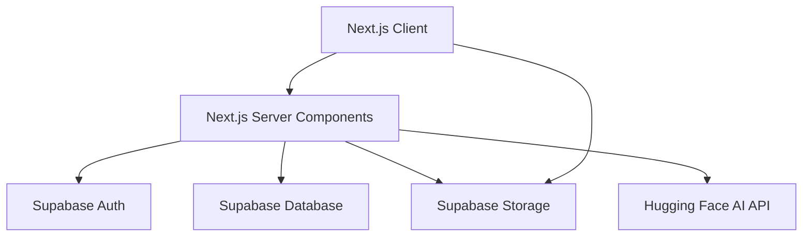
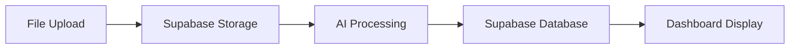
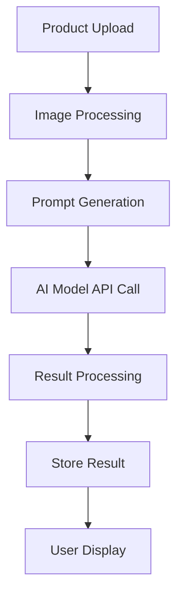

# DRAMPA System Patterns

## Architecture Overview
DRAMPA follows a modern client-centric architecture with serverless backend components:

## Component Structure
The application follows a component-based architecture with:

1. **UI Components**: Reusable interface elements
   - Located in `src/components/ui/`
   - Includes: Button, FileUpload, DotPattern, AnimatedGradientText
   - Styled with Tailwind CSS

2. **Section Components**: Page sections
   - Located in `src/components/sections/`
   - Example: HeroSection with file upload functionality

3. **Page Components**: Full pages
   - Located in `src/app/` following Next.js App Router structure
   - Composed of multiple section components

## Key Design Patterns

### Client-Side State Management
- Using React's useState for component-level state
- SessionStorage for cross-page data persistence
- Potential future implementation: Zustand for global state

### Serverless Data Flow

### Component Composition
UI components are designed for composition, with:
- Props for customization
- Tailwind utility classes for styling
- Conditional rendering based on state

## UI/UX Patterns
- **Brand Color**: Orange (#FF7722) as primary theme
- **Visual Feedback**: Loading states during async operations
- **Responsive Layout**: Grid-based with mobile-first approach
- **Dot Pattern**: Background element with radial gradient mask

## Data Patterns
- Image uploads to be stored in Supabase storage
- User session management via Supabase Auth
- Dashboard data retrieval from Supabase Database

## AI Integration Pattern
